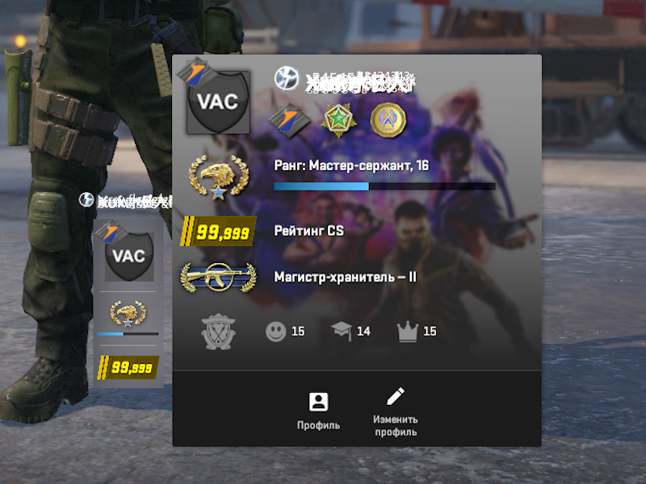

# **CS2 Rating Modifier**

This Python script allows you to modify the in-game rating for **Counter-Strike 2** by dynamically accessing and editing memory values. It uses pointer-based memory manipulation to locate and update the desired value.



---

## **Features**
- Dynamically reads and writes memory values of the CS2 process.
- Calculates pointer-based memory addresses for precise modifications.
- Allows the user to input a custom rating value.

---

## **Requirements**
This script requires the following dependencies to work properly:

1. **Python (3.8 or higher)**  
   Make sure you have Python installed. You can download it from [python.org](https://www.python.org/).

2. **Required Python Libraries**  
   Install these dependencies before running the script:
   - `psutil`: For finding and interacting with processes.
   - `pymem`: For memory manipulation.  

   You can install them with the following command:
   ```bash
   pip install psutil pymem
   ```

3. **Administrator Privileges**  
   The script requires admin rights to access and modify memory values of other processes. Be sure to run it with elevated permissions.

---

## **How to Use**
1. **Start CS2**  
   Ensure that Counter-Strike 2 is running before executing the script.

2. **Run the Script**  
   Execute the Python script in a terminal or IDE.

3. **Input the Rating**  
   When prompted, enter the new desired rating value (integer). The script will locate the memory address and apply the change.

---

## **Disclaimer**
This script is for educational purposes only. The author is not responsible for any consequences arising from the use of this program, including bans or damages. Use at your own risk.
